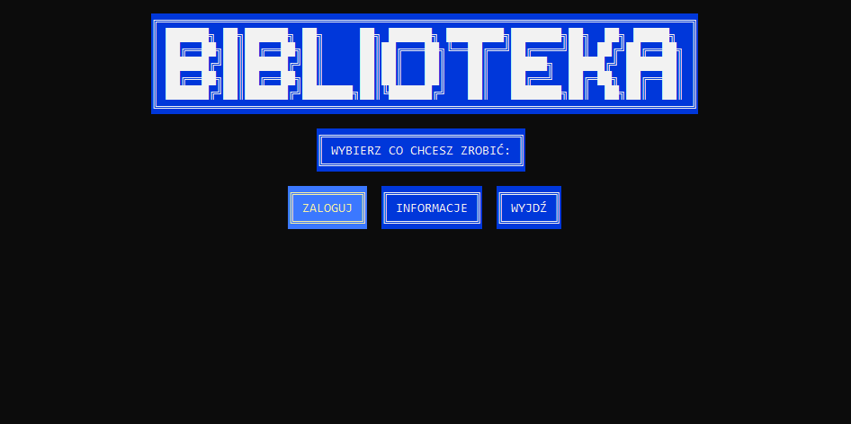
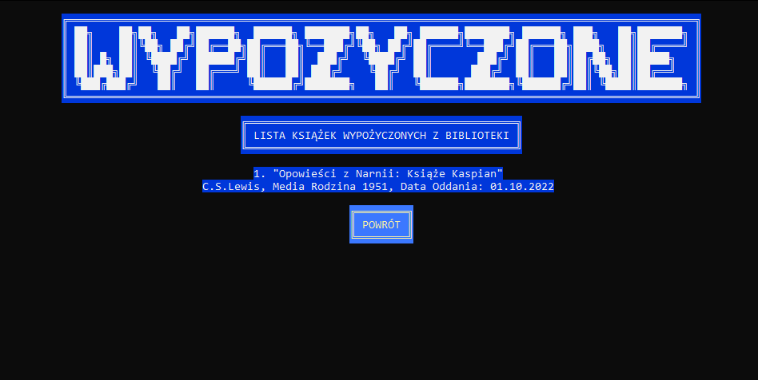
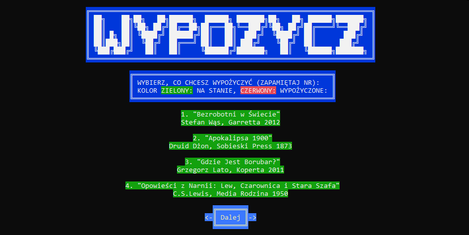

# Panel Biblioteczny

### Opis aplikacji

Aplikacja konsolowa (C#) wykonana na potrzeby projektu zaliczeniowego koła naukowego KOLOR UG.

W aplikacji występują 2 role: użytkownik (czytelnik) oraz bibliotekarz (pracownik).

Użytkowik może wykonać następujące akcje:

* przejrzeć listę wypożyczonych książek
* dodać nowe wypożyczenie
* oddać książkę

Bibliotekarz posiada następujące uprawnienia:

* dodawanie nowych książek
* usuwanie książek
* edytowanie książek
* przeglądanie listy użytkowników

Poruszanie się po aplikacji:

* wybieranie opcji (przycisków): strzałki
* akceptowanie i naciskanie przycisków: enter

### Baza danych

Zastosowana została mockowana baza danych (tworzona w momencie włączenia aplikacji)

Dane do logowania:

* Użytkownicy (czytelnicy):
  <ul>
    <li>Login: chris  Hasło: 123</li>
    <li>Login: muczka  Hasło: 123</li>
    <li>Login: burek  Hasło: 123</li>
  </ul>
  
* Bibliotekarz (pracownik):
  <ul>
    <li>Login: bibliotek  Hasło: 123</li>
  </ul>

### Uruchamianie aplikacji

Aby uruchomić aplikację należy pobrać wszystkie pliki z repozytorium i otworzyć przy użyciu oprogramowania Visual Studio

### Prezentacja aplikacji

* Panel główny

* Lista książek wypożyczonych przez użytkownika

* Lista książek do wypożyczenia

